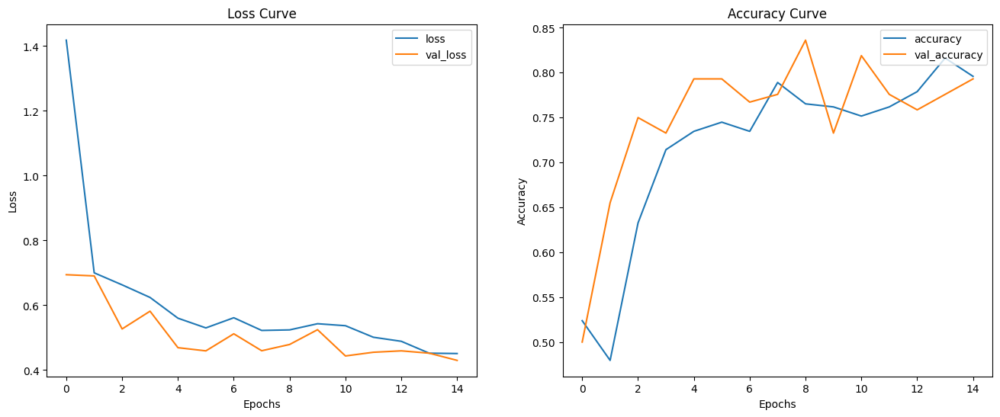

# DeepSalsa AI

aIn <a href="https://github.com/Morpheus5828/SALSA">SALSA project</a>, we have seen different method to classify our pictur using Machine Learning,  
but these methods was a litle bit deprecated and with this project, I've changed my way of thinking.  
I've decided to use Deep Learning approach with CNN. Let's have a look on DeepSalsa.ipynb file.

That's result:

**Accuracy score:** 0.83  
**Loss:** 0.479  
**F1_score:** 0.571  
**Precision:** 0.557 
**Rappel:** 0.586  

# Test with your picture !

- [numpy](https://numpy.org/) : `pip install numpy`
- [tensorflow](https://www.tensorflow.org/) : `pip install tensorflow`
- [matplotlib](https://matplotlib.org/) : `pip install matplotlib`
- [streamlit](https://streamlit.io/): `pip install streamlit`
- [PIL](https://he-arc.github.io/livre-python/pillow/index.html)`pip install PIL`
- [OpenCV](https://opencv24-python-tutorials.readthedocs.io/en/latest/) `pip install opencv-python`

``
streamlit run yourscript.py``